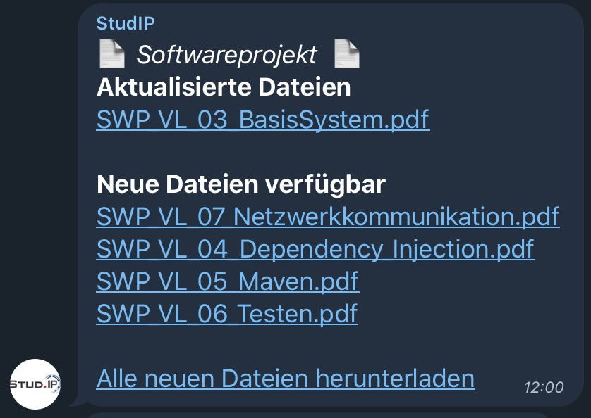

# Java-StudIP-Telegram-Bot
Proof of Concept Java StudIP Telegram Bot

## Overview

*What will this Bot do?*
 - It will simply login to your StudIP-Account using your Credentials (Stored localy and secure)
 - It will grab your Accountinformations, Courses and Informations about the Courses
 - It will verify that there are Updates avaiable (News or Files)
 - It will download new Files and create a Filesturcture analog to StudIP (Easy to Sync to NAS for example)
 - It will automatically format and push these Informations to a Telegram Chat using your own Bot
 
 ### FAQ
 *Our StudI-Api is not activated. Will it still work?*
Yes. This Bot works using a virtual Browser instance to comunicate with StudIP. So no API is needet :)

## Installation

1. Download this Bot
2. Verify that Java 8 JRE is installed on your machine
3. Create a Telegram Bot (Simply create a Chat with [@BotFather](https://t.me/BotFather))
4. Copy the API-Key
5. Start the Bot via Terminal with `java -jar StudIP-Telegram.jar INIT`
6. Fill out your Credentials
7. ...
8. Profit?

## Roadmap

- More settings, customisation
- Better commandline Interface
- Optimise Code a Lot
- Add a Ton of Documentation
etc.

MORE WILL FOLLOW